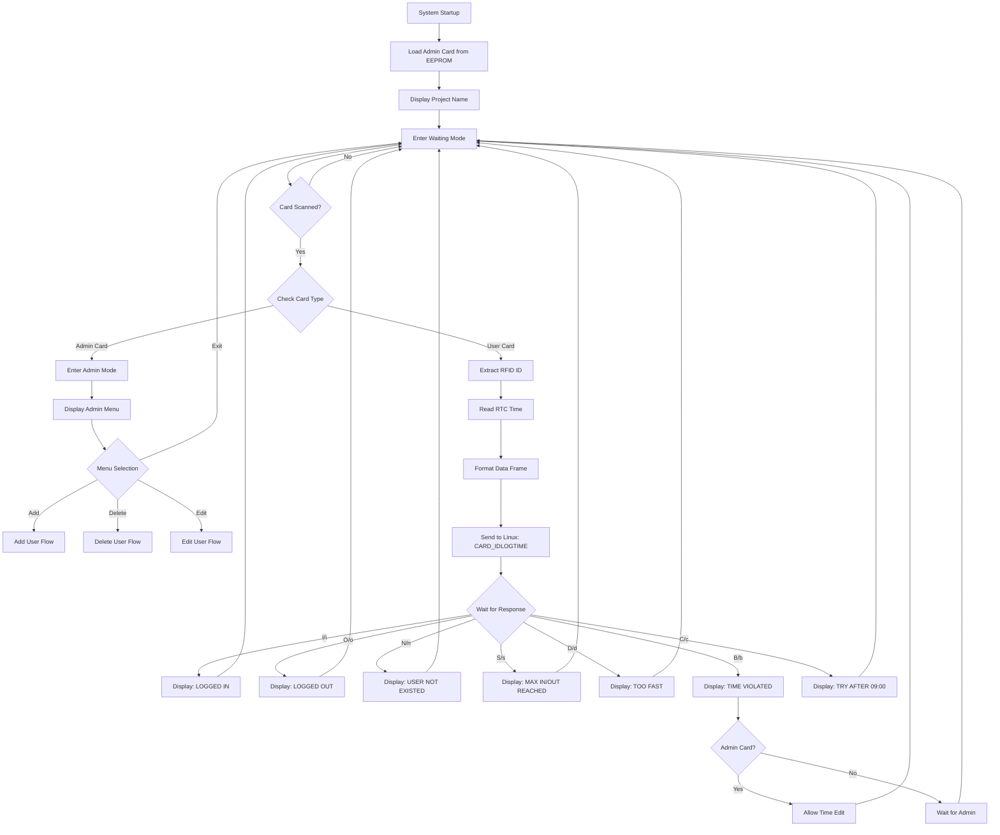

# 🎯 ATTENDIFY-RFID: Smart Employee Tracking & Reporting System

<div align="center">


**A professional-grade RFID-based attendance management system with real-time tracking, database integration, and automated reporting capabilities.**

[Features](#-key-features) • [Architecture](#-system-architecture) • [Hardware](#-hardware-components) • [Installation](#-installation--setup) • [Usage](#-usage-guide) • [Documentation](#-documentation)

</div>

---

## 📋 Table of Contents

- [Overview](#-overview)
- [Key Features](#-key-features)
- [System Architecture](#-system-architecture)
- [Hardware Components](#-hardware-components)
- [Software Stack](#-software-stack)
- [Installation & Setup](#-installation--setup)
- [Usage Guide](#-usage-guide)
- [System Workflow](#-system-workflow)
- [Database Schema](#-database-schema)
- [RFID Protocol](#-rfid-protocol)
- [Admin Functions](#-admin-functions)
- [Troubleshooting](#-troubleshooting)
- [Future Enhancements](#-future-enhancements)
- [Contributing](#-contributing)
- [License](#-license)
- [Acknowledgments](#-acknowledgments)

---

## 🌟 Overview

**ATTENDIFY-RFID** is an advanced employee attendance and monitoring system that revolutionizes workforce tracking through contactless RFID technology. Built on the ARM LPC2148 microcontroller platform, this system eliminates manual attendance methods, significantly reducing human errors and administrative overhead while providing real-time insights into employee presence, working hours, and punctuality.

### Why ATTENDIFY-RFID?

- ⚡ **Fast & Contactless**: Instant identification through RFID card scanning
- 🎯 **Accurate Timestamping**: Precise entry/exit tracking with RTC integration
- 📊 **Real-time Reporting**: Live attendance logs with comprehensive analytics
- 🔒 **Secure Administration**: Multi-level access control with admin privileges
- 💾 **Persistent Storage**: Non-volatile EEPROM-based data retention
- 🖥️ **Linux Integration**: Seamless database synchronization via UART communication

---

## ✨ Key Features

### Core Functionality

| Feature | Description |
|---------|-------------|
| 🆔 **RFID Authentication** | Contactless employee identification using 125kHz RFID cards |
| ⏰ **Real-Time Clock** | Accurate timestamping with DS1307 RTC for all attendance events |
| 📱 **LCD Display** | 16x2 character LCD for instant feedback and system status |
| 🔐 **Admin Mode** | Secure administrative functions with dedicated admin card |
| 💾 **EEPROM Storage** | AT25LC512 SPI EEPROM for persistent admin card storage |
| 🔌 **Dual UART** | UART0 for PC communication, UART1 for RFID reader interface |
| ⌨️ **Keypad Interface** | 4x4 matrix keypad for menu navigation and data entry |
| 🔄 **Bi-directional Communication** | Two-way data exchange with Linux host system |

### Advanced Capabilities

- **User Management**: Add, edit, and delete employees through admin interface
- **Automated Logging**: Automatic IN/OUT status tracking with time validation
- **Working Hours Calculation**: Real-time computation of employee work duration
- **CSV Database Integration**: Structured data storage in industry-standard format
- **Time Violation Detection**: Intelligent checks for attendance irregularities
- **Multiple Entry Handling**: Support for multiple IN/OUT cycles per day
- **Admin Card Update**: Dynamic admin card replacement without firmware reflashing

---

## 🏗️ System Architecture

### Block Diagram

```
┌─────────────────────────────────────────────────────────────────┐
│                     ATTENDIFY-RFID SYSTEM                       │
├─────────────────────────────────────────────────────────────────┤
│                                                                 │
│  ┌──────────────┐         ┌─────────────────┐                 │
│  │   SWITCH     │◄───────►│      RTC        │                 │
│  │ (EDIT MODE)  │  EINT0  │  (DS1307/equiv) │                 │
│  └──────────────┘         └─────────────────┘                 │
│         │                           │                          │
│         ▼                           ▼                          │
│  ┌────────────────────────────────────────┐                   │
│  │                                        │                   │
│  │          ARM LPC2148                   │    ┌───────────┐  │
│  │       Microcontroller                  │◄──►│    LCD    │  │
│  │      (Main Controller)                 │    │  Display  │  │
│  │                                        │    └───────────┘  │
│  │  • GPIO for LCD/Keypad                │                   │
│  │  • SPI for EEPROM                     │    ┌───────────┐  │
│  │  • UART0 for PC (MAX232)              │◄──►│  4x4 KEY  │  │
│  │  • UART1 for RFID                     │    │   PAD     │  │
│  │  • I2C for RTC                        │    └───────────┘  │
│  │                                        │                   │
│  └────────────────────────────────────────┘                   │
│         │                    │                                │
│         ▼                    ▼                                │
│  ┌──────────────┐    ┌──────────────┐                        │
│  │  AT25LC512   │    │ RFID READER  │                        │
│  │   EEPROM     │    │  (125kHz)    │                        │
│  │  (SPI)       │    │  AT89C2051   │                        │
│  └──────────────┘    └──────────────┘                        │
│                              │                                │
│                              ▼                                │
│                      ┌──────────────┐                         │
│                      │  RFID CARDS  │                         │
│                      │ (8-byte ID)  │                         │
│                      └──────────────┘                         │
│                                                                │
│                      ┌──────────────┐                         │
│                      │   MAX232     │                         │
│                      │   RS-232     │                         │
│                      │  Converter   │                         │
│                      └──────────────┘                         │
│                              │                                │
│                              ▼                                │
│                   ┌─────────────────────┐                     │
│                   │   PC (LINUX OS)     │                     │
│                   │  • UART Interface   │                     │
│                   │  • Database (.CSV)  │                     │
│                   │  • Reporting Engine │                     │
│                   └─────────────────────┘                     │
│                                                                │
└────────────────────────────────────────────────────────────────┘
```

### Communication Protocol

```
Microcontroller → PC Communication Format:
┌────────────────────────────────────────────────────┐
│ ADMIN Card:  [CARD_ID](ADD/DEL/EDT){HH:MM:SS}     │
│ USER Card:   [CARD_ID](LOG){HH:MM:SS}             │
└────────────────────────────────────────────────────┘

PC → Microcontroller Response Format:
┌────────────────────────────────────────────────────┐
│ Y/y - Operation successful                         │
│ N/n - User not found / User exists                 │
│ I/i - Logged IN                                    │
│ O/o - Logged OUT                                   │
│ A/a - File not found                               │
│ S/s - Maximum IN/OUT reached                       │
│ D/d - Too fast (wait 10 seconds)                   │
│ B/b - Time violation detected                      │
│ C/c - Access denied (before 09:00:00)              │
└────────────────────────────────────────────────────┘
```

---

## 🔧 Hardware Components

### Primary Components

| Component | Specification | Purpose |
|-----------|---------------|---------|
| **Microcontroller** | ARM LPC2148 (60MHz, 512KB Flash) | Main processing unit |
| **RFID Reader** | 125kHz, AT89C2051 based, 10-byte output | Card detection & ID extraction |
| **RFID Cards** | 125kHz passive tags | Employee identification |
| **LCD Display** | 16x2 character display | User feedback & status |
| **RTC Module** | DS1307 or compatible (I2C) | Real-time timestamping |
| **EEPROM** | AT25LC512 (512Kbit SPI) | Admin card storage |
| **Keypad** | 4x4 matrix keypad | Menu navigation & input |
| **Level Shifter** | MAX232 | RS-232 voltage conversion |
| **Switch** | Push button (EINT0) | Settings menu trigger |
| **USB-UART** | USB to UART converter | Programming & debugging |

### Pin Configuration

<details>
<summary>Click to expand pin mapping</summary>

```
LPC2148 Pin Mapping:
├── LCD Interface (GPIO)
│   ├── RS → P0.x
│   ├── RW → P0.x
│   ├── EN → P0.x
│   └── D4-D7 → P0.x
├── Keypad (GPIO)
│   ├── Row0-Row3 → P1.x
│   └── Col0-Col3 → P1.x
├── UART0 (PC Communication)
│   ├── TXD0 → P0.0
│   └── RXD0 → P0.1
├── UART1 (RFID Reader)
│   ├── TXD1 → P0.8
│   └── RXD1 → P0.9
├── SPI (EEPROM)
│   ├── SCK → P0.4
│   ├── MISO → P0.5
│   ├── MOSI → P0.6
│   └── SSEL → P0.7
├── I2C (RTC)
│   ├── SDA → P0.2
│   └── SCL → P0.3
└── External Interrupt
    └── EINT0 → P0.16 (Settings Switch)
```

</details>

### RFID Reader Data Format

The RFID reader outputs **10 bytes** per card scan:

```
┌────┬────┬────┬────┬────┬────┬────┬────┬────┬────┐
│0x02│0x31│0x32│0x33│0x34│0x35│0x36│0x37│0x38│0x03│
└────┴────┴────┴────┴────┴────┴────┴────┴────┴────┘
  STX   D1   D2   D3   D4   D5   D6   D7   D8   ETX

For card number: 12345678
├── 0x02: Start of text (STX)
├── 0x31-0x38: ASCII digits (1-8)
└── 0x03: End of text (ETX)
```

---

## 💻 Software Stack

### Embedded System (LPC2148)

```
Technology Stack:
├── Programming Language: Embedded C
├── Compiler: Keil µVision (ARM Compiler)
├── Flashing Tool: Flash Magic
├── Peripheral Drivers:
│   ├── lcd.c / lcd.h - LCD 16x2 driver
│   ├── uart.c / uart.h - UART0 & UART1 drivers
│   ├── keypad.c / keypad.h - 4x4 keypad driver
│   ├── spi.c / spi.h - SPI master driver
│   ├── spi_eeprom.c / spi_eeprom.h - AT25LC512 driver
│   ├── delay.c / delay.h - Timing utilities
│   ├── rtc.c / rtc.h - RTC interface
│   └── admin.c / admin.h - Application logic
└── Build System: Keil Project Files (.uvproj)
```

### Host System (Linux)

```
Technology Stack:
├── OS: Linux (Ubuntu/Debian recommended)
├── Language: C/Python
├── Communication: UART (115200 baud, 8N1)
├── Database: CSV file format
├── Terminal: Custom UART terminal application
└── Dependencies:
    ├── termios.h (UART control)
    ├── fcntl.h (File operations)
    └── stdio.h (CSV handling)
```

---

## 🚀 Installation & Setup

### Prerequisites

#### Hardware Setup
1. ARM LPC2148 development board
2. RFID reader module (125kHz) with cards
3. 16x2 LCD display
4. 4x4 matrix keypad
5. AT25LC512 SPI EEPROM
6. DS1307 RTC module
7. MAX232 level shifter
8. USB-to-UART converter
9. Connecting wires and breadboard

#### Software Requirements
- **Windows PC**: Keil µVision IDE, Flash Magic
- **Linux PC**: GCC compiler, termios library
- **Both**: Serial terminal (PuTTY/Minicom/custom)

### Step 1: Clone the Repository

```bash
git clone https://github.com/yourusername/attendify-rfid.git
cd attendify-rfid
```

### Step 2: Embedded Code Setup

```bash
# Navigate to embedded code directory
cd embedded/

# Project structure should contain:
# ├── lcd.c / lcd.h
# ├── uart.c / uart.h
# ├── keypad.c / keypad.h
# ├── spi.c / spi.h
# ├── spi_eeprom.c / spi_eeprom.h
# ├── delay.c / delay.h
# ├── rtc.c / rtc.h
# ├── admin.c / admin.h
# └── main.c
```

**Compile in Keil µVision:**
1. Open the `.uvproj` project file
2. Build the project (`F7`)
3. Generate HEX file
4. Flash using Flash Magic or ISP programmer

### Step 3: Linux Host Code Setup

```bash
# Navigate to Linux code directory
cd ../linux_host/

# Compile the UART application
gcc -o attendance_system uart_attendance.c -Wall

# Make executable
chmod +x attendance_system

# Create initial CSV database
touch attendance.csv
```

### Step 4: Initial CSV Database Format

Create `attendance.csv` with the following structure:

```csv
S.No,USER_ID,USER_NAME,DATE,WORKING_HOURS,IN/OUT_STATUS,IN_1,OUT_1,IN_2,OUT_2
```

### Step 5: Hardware Connections

1. **Connect LCD to LPC2148** (refer to pin configuration)
2. **Connect RFID reader to UART1** (TXD1, RXD1)
3. **Connect keypad to GPIO pins**
4. **Connect EEPROM via SPI**
5. **Connect RTC via I2C**
6. **Connect MAX232 to UART0** for PC communication
7. **Connect EINT0 to settings button**

### Step 6: Initial Configuration

1. **Program default admin card:**
   ```c
   // In first boot, use interrupt (EINT0) to set admin card
   // Select Option 1: ADMIN CHANGE
   // Scan new admin RFID card
   ```

2. **Verify RTC time:**
   ```c
   // Use interrupt menu to set RTC
   // Select Option 2: RTC SET
   // Enter time using keypad
   ```

---

## 📖 Usage Guide

### System Startup

1. Power on the LPC2148 system
2. LCD displays: **"ATTENDIFY-RFID"**
3. System loads admin card from EEPROM
4. Enters waiting mode: **"SCAN CARD"**

### Daily Operations

#### For Employees (User Cards)

```
Flow:
1. Employee scans RFID card
2. LCD shows "CARD TAPPED"
3. System sends: [12345678](LOG){09:15:30}
4. Linux host processes request
5. LCD displays one of:
   ├── "LOGGED IN" (if OUT → IN)
   ├── "LOGGED OUT" (if IN → OUT)
   ├── "USER NOT EXISTED" (unregistered)
   ├── "MAXIMUM IN & OUT REACHED" (limit exceeded)
   ├── "TOO FAST OUT" (< 10 seconds)
   ├── "TIME VIOLATED" (before 09:00:00)
   └── "FILE NOT FOUND" (database error)
```

#### For Administrators (Admin Card)

```
Flow:
1. Admin scans admin RFID card
2. System enters admin mode
3. LCD shows menu:
   ┌──────────────────┐
   │ 1.ADD    2.DEL   │
   │ 3.EDIT   4.EXIT  │
   └──────────────────┘
4. Select operation using keypad
5. Follow on-screen prompts
```

### Admin Functions

#### 1️⃣ Add User

```
Steps:
1. Select option '1'
2. LCD: "TAP NEW CARD"
3. Scan employee's RFID card
4. LCD: "CARD TAPPED"
5. System sends: [CARD_ID](ADD){TIME}
6. Linux prompts for:
   ├── Employee Name
   └── Confirmation
7. LCD shows: "USER ADDED" or "USER EXISTED"
```

#### 2️⃣ Delete User

```
Steps:
1. Select option '2'
2. LCD: "TAP USERCARD"
3. Scan employee's card to delete
4. System sends: [CARD_ID](DEL){TIME}
5. Linux confirms deletion
6. LCD shows: "USER DELETED" or "USER NOT EXISTED"
```

#### 3️⃣ Edit User

```
Steps:
1. Select option '3'
2. LCD: "TAP USERCARD"
3. Scan employee's card to edit
4. System sends: [CARD_ID](EDT){TIME}
5. Linux prompts for updated information
6. LCD shows: "USER EDITED"
```

#### 4️⃣ Exit Admin Mode

```
Press '4' or '#' to return to normal operation
```

### Settings Menu (EINT0 Interrupt)

Press the **settings button** to access:

```
┌──────────────────────┐
│ 1. ADMIN CHANGE      │
│ 2. RTC SET           │
│ 3. BACK              │
└──────────────────────┘
```

**Admin Change:**
- Scan new admin card
- System confirms and updates EEPROM

**RTC Set:**
- Enter current time using keypad
- Format: HH:MM:SS (24-hour)
- System updates RTC module

---

## 🔄 System Workflow

### Complete Attendance Cycle



### Linux Host Application Flow

```
Main Loop:
├── 1. Initialize UART Communication
├── 2. Load CSV Database
├── 3. Display All Users
├── 4. Enter Listening Mode
├── 5. Wait for Microcontroller Data
│
└── On Data Reception:
    ├── Parse Frame: [CARD_ID](PURPOSE){TIME}
    │
    ├── If Admin Card:
    │   ├── Display Admin Menu
    │   ├── Process Selection:
    │   │   ├── ADD: Create new user entry
    │   │   ├── DEL: Remove user from CSV
    │   │   ├── EDT: Modify user data
    │   │   └── EXIT: Send exit acknowledgment
    │   └── Send Response: Y/N
    │
    └── If User Card:
        ├── Search User in CSV
        ├── Read IN/OUT Status
        ├── Toggle Status (0→1 or 1→0)
        ├── Update Timestamp
        ├── Calculate Working Hours
        ├── Write to CSV
        ├── Send Response: I/O/N/S/D/B/C
        └── Continue Listening
```

---

## 🗄️ Database Schema

### CSV File Structure

```csv
S.No | USER_ID  | USER_NAME    | DATE       | WORKING_HOURS | IN/OUT_STATUS | IN_1     | OUT_1    | IN_2     | OUT_2
-----|----------|--------------|------------|---------------|---------------|----------|----------|----------|----------
1    | 12345678 | John Doe     | 2025-01-15 | 08:45:30      | 0             | 09:00:00 | 18:45:30 | --:--:-- | --:--:--
2    | 87654321 | Jane Smith   | 2025-01-15 | 09:15:45      | 1             | 08:30:00 | --:--:-- | --:--:-- | --:--:--
3    | 11223344 | Mike Johnson | 2025-01-15 | 04:20:15      | 0             | 09:15:00 | 13:35:15 | --:--:-- | --:--:--
```

**Field Descriptions:**

| Field | Type | Description |
|-------|------|-------------|
| `S.No` | Integer | Sequential record number |
| `USER_ID` | String(8) | RFID card number (8 digits) |
| `USER_NAME` | String | Employee full name |
| `DATE` | Date (YYYY-MM-DD) | Current attendance date |
| `WORKING_HOURS` | Time (HH:MM:SS) | Total working duration for the day |
| `IN/OUT_STATUS` | Boolean | 0 = OUT, 1 = IN (current status) |
| `IN_1` | Time (HH:MM:SS) | First entry time |
| `OUT_1` | Time (HH:MM:SS) | First exit time |
| `IN_2` | Time (HH:MM:SS) | Second entry time (if applicable) |
| `OUT_2` | Time (HH:MM:SS) | Second exit time (if applicable) |

### Working Hours Calculation

```c
// Pseudocode for working hours calculation
total_hours = 0;
if (OUT_1 != null) {
    total_hours += (OUT_1 - IN_1);
}
if (OUT_2 != null) {
    total_hours += (OUT_2 - IN_2);
}
WORKING_HOURS = total_hours;
```

---

## 🔐 RFID Protocol

### Card Detection Flow

```
RFID Reader → UART1 → LPC2148
├── Baud Rate: 9600/19200 bps
├── Data Bits: 8
├── Parity: None
├── Stop Bits: 1
└── Flow Control: None
```

### Data Frame Extraction

```c
void ExtractRFID(char *buffer) {
    // Input: 0x02 0x31 0x32 0x33 0x34 0x35 0x36 0x37 0x38 0x03
    // Output: "12345678"
    
    char rfid_id[9];
    int j = 0;
    
    for (int i = 1; i < 9; i++) {  // Skip STX (0x02)
        rfid_id[j++] = buffer[i];  // Extract digits
    }
    rfid_id[j] = '\0';  // Null terminate
}
```

### Card Number Format

- **Length**: 8 ASCII digits
- **Range**: 00000001 - 99999999
- **Encoding**: ASCII (0x30-0x39 for digits 0-9)
- **Validation**: Must be numeric only

---

## 🛠️ Admin Functions

### Function Implementations

#### Change Admin Card

```c
void change_admin(void) {
    char new_admin_id[12];
    char old_admin_id[10];
    
    // Display prompt
    CmdLCD(CLEAR_LCD);
    StrLCD("SCAN NEW ADMIN");
    CmdLCD(GOTO_LINE2_POS0);
    StrLCD("      CARD");
    
    // Read new card
    Receive_string_UART1(new_admin_id, 10);
    ExtractRFID(new_admin_id);
    
    // Read old admin from EEPROM
    Receive_string_from_EEPROM(old_admin_id, 8, 0x0000);
    
    // Check if same
    if (strcmp(new_admin_id, old_admin_id) == 0) {
        StrLCD("ADMIN EXISTED...!");
        delay_ms(1000);
    } else {
        // Confirm and update
        StrLCD("TO CONFIRM PRESS KEY");
        key = KeyScan();
        Write_string_to_EEPROM(new_admin_id, 0x0000);
        StrLCD("ADMIN UPDATED SUCCESSFULLY");
    }
}
```

#### Check Admin Privileges

```c
char check_admin(char *ID) {
    char old_admin_id[10];
    Receive_string_from_EEPROM(old_admin_id, 8, 0x0000);
    
    if (strcmp(ID, old_admin_id) == 0) {
        return 'A';  // Admin confirmed
    } else {
        return 'B';  // Regular user
    }
}
```

#### Frame Construction

```c
void frame(char *frame, char *ID, char *purpose) {
    // Format: [CARD_ID](PURPOSE){HH:MM:SS}
    int i = 0;
    
    // ID Field
    frame[i++] = '[';
    for (int j = 0; ID[j]; j++) {
        frame[i++] = ID[j];
    }
    frame[i++] = ']';
    
    // Purpose Field
    frame[i++] = '(';
    for (int j = 0; purpose[j]; j++) {
        frame[i++] = purpose[j];
    }
    frame[i++] = ')';
    
    // Time Field
    frame[i++] = '{';
    frame[i++] = (HOUR / 10) + '0';
    frame[i++] = (HOUR % 10) + '0';
    frame[i++] = ':';
    frame[i++] = (MIN / 10) + '0';
    frame[i++] = (MIN % 10) + '0';
    frame[i++] = ':';
    frame[i++] = (SEC / 10) + '0';
    frame[i++] = (SEC % 10) + '0';
    frame[i++] = '}';
    
    frame[i] = '\0';  // Null terminate
}
```

---

## 🐛 Troubleshooting

### Common Issues & Solutions

| Problem | Possible Cause | Solution |
|---------|---------------|----------|
| **LCD shows garbage** | Incorrect initialization / Wrong connections | Check pin mapping, verify 5V power, reinitialize LCD |
| **RFID not detected** | UART1 not configured / Wrong baud rate | Set UART1 to 9600/19200, check RX/TX connections |
| **Admin card not saved** | EEPROM not responding | Verify SPI connections, check EEPROM power |
| **Time always 00:00:00** | RTC not initialized / Battery dead | Set RTC via menu, replace CR2032 battery |
| **No PC response** | MAX232 issue / UART0 not working | Test with loopback, verify MAX232 ±10V levels |
| **"WAITING FOR OS"** | Linux app not running / Baud mismatch | Start Linux app, match baud rates (115200) |
| **User not added** | CSV file locked / Permission denied | Close file, check Linux permissions |
| **Keypad not working** | Wrong scanning delay / Debouncing issue | Adjust delay_ms(), verify pull-up resistors |

### Debug Mode

Enable debug output in code:

```c
#define DEBUG_MODE 1

#ifdef DEBUG_MODE
    Transmit_string_UART0("DEBUG: Card ID = ");
    Transmit_string_UART0(card_id);
    Transmit_string_UART0("\r\n");
#endif
```

### Serial Monitor Commands

```bash
# Linux: Monitor UART traffic
minicom -D /dev/ttyUSB0 -b 115200

# Test UART loopback
echo "[12345678](LOG){09:30:00}" > /dev/ttyUSB0

# Check device
ls -l /dev/ttyUSB0
```

---

## 🔮 Future Enhancements

### Planned Features

- [ ] **Wi-Fi Integration**: ESP8266/ESP32 for wireless data transmission
- [ ] **Web Dashboard**: Real-time monitoring via web browser
- [ ] **Mobile App**: Android/iOS companion app for managers
- [ ] **Fingerprint Module**: Multi-factor authentication (RFID + Fingerprint)
- [ ] **GSM Module**: SMS notifications for late arrivals
- [ ] **SD Card Logging**: Local backup storage
- [ ] **Thermal Printer**: Instant attendance receipt printing
- [ ] **OLED Display**: Graphical user interface upgrade
- [ ] **MySQL Database**: Professional database backend
- [ ] **REST API**: Integration with existing HR systems
- [ ] **Facial Recognition**: AI-powered attendance verification
- [ ] **Access Control**: Door lock integration

### Performance Optimizations

- [ ] Interrupt-driven UART for faster response
- [ ] DMA for LCD data transfer
- [ ] Hash table for faster user lookup
- [ ] Circular buffer for RFID data
- [ ] Low-power mode when idle

---

## 🤝 Contributing

Contributions are welcome! Please follow these guidelines:

### How to Contribute

1. **Fork the repository**
2. **Create a feature branch**
   ```bash
   git checkout -b feature/amazing-feature
   ```
3. **Commit your changes**
   ```bash
   git commit -m "Add amazing feature"
   ```
4. **Push to the branch**
   ```bash
   git push origin feature/amazing-feature
   ```
5. **Open a Pull Request**

### Code Standards

- Use **consistent indentation** (4 spaces)
- **Comment your code** thoroughly
- Follow **embedded C best practices**
- **Test on actual hardware** before submitting
- Update **documentation** for new features

### Reporting Bugs

Please include:
- Hardware configuration
- Steps to reproduce
- Expected vs actual behavior
- Serial monitor logs
- Photos/videos if applicable

---

## 📄 License

This project is licensed under the **MIT License** - see the [LICENSE](LICENSE) file for details.

```
MIT License

Copyright (c) 2025 [AAKIREDDY SANATH VARMA]

Permission is hereby granted, free of charge, to any person obtaining a copy
of this software and associated documentation files (the "Software"), to deal
in the Software without restriction, including without limitation the rights
to use, copy, modify, merge, publish, distribute, sublicense, and/or sell
copies of the Software, and to permit persons to whom the Software is
furnished to do so, subject to the following conditions:

The above copyright notice and this permission notice shall be included in all
copies or substantial portions of the Software.

THE SOFTWARE IS PROVIDED "AS IS", WITHOUT WARRANTY OF ANY KIND, EXPRESS OR
IMPLIED, INCLUDING BUT NOT LIMITED TO THE WARRANTIES OF MERCHANTABILITY,
FITNESS FOR A PARTICULAR PURPOSE AND NONINFRINGEMENT. IN NO EVENT SHALL THE
AUTHORS OR COPYRIGHT HOLDERS BE LIABLE FOR ANY CLAIM, DAMAGES OR OTHER
LIABILITY, WHETHER IN AN ACTION OF CONTRACT, TORT OR OTHERWISE, ARISING FROM,
OUT OF OR IN CONNECTION WITH THE SOFTWARE OR THE USE OR OTHER DEALINGS IN THE
SOFTWARE.
```

---

## 🙏 Acknowledgments

### Special Thanks To

- **ARM Community**: For comprehensive LPC2148 documentation
- **Keil**: For the excellent µVision IDE
- **Open Source Community**: For UART libraries and examples
- **Vector Institute**: For advanced embedded systems training
- **Project Contributors**: Everyone who helped build this system

### References & Resources

- [LPC2148 Datasheet](https://www.nxp.com/docs/en/user-guide/UM10139.pdf)
- [AT25LC512 EEPROM Datasheet](https://ww1.microchip.com/downloads/en/DeviceDoc/20005715A.pdf)
- [RFID Technology Guide](https://en.wikipedia.org/wiki/Radio-frequency_identification)
- [Embedded C Programming Guide](https://www.embedded.com/programming-embedded-systems-in-c/)

### Tools Used

- **Keil µVision IDE** - Embedded development
- **Flash Magic** - LPC2148 programming
- **PuTTY/Minicom** - Serial communication
- **VS Code** - Documentation & scripting
- **Git** - Version control

---

## 📞 Contact & Support

### Project Maintainer

**Name**: SANATH VARMA AAKIREDDY 
**Email**: sanathvarma999@gmail.com.com  
**GitHub**: [@sanath varma](https://github.com/sanath-varma)  
**LinkedIn**: [Sanath - ECE Engineer](www.linkedin.com/in/sanath-varma-aakireddy)

### Get Help

- 📧 **Email**: For private inquiries: sanathvarma999@gmail.com


---

## 📊 Project Stats

<div align="center">


</div>

---

## ⭐ Show Your Support

If this project helped you, please consider giving it a ⭐ star!

**Made with ❤️ by Sanath | Electronics & Communication Engineer | Embedded Systems Enthusiast**

---

<div align="center">
  <sub>Built with ARM LPC2148 • RFID Technology • Embedded C • Linux Integration</sub>
</div>
